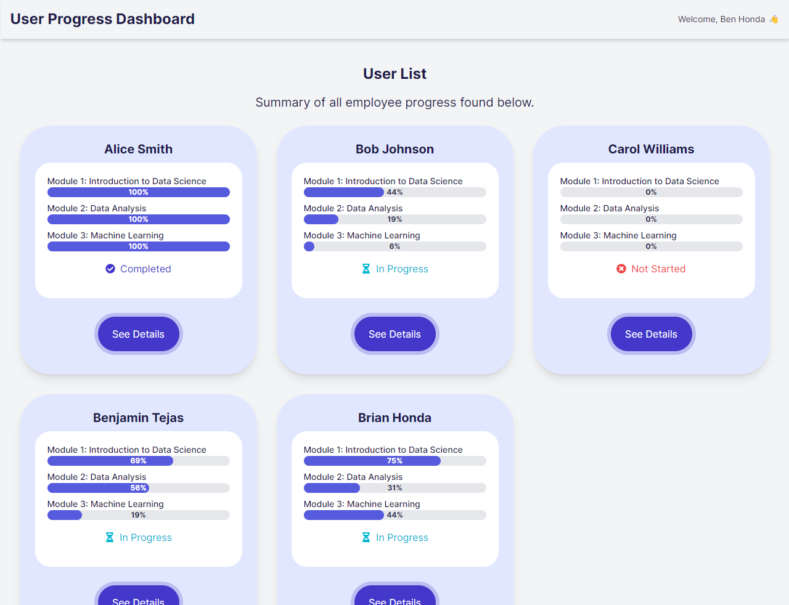

# User Progress Dashboard Assessment
Hi! This is what I've completed for my dashboard assessment. 

# Styling Influence
I based the color pallete and button styling on the Loom site.
I also made the UserCards similar/based off of the cards you see when you scroll down on the Loom homepage.

# Added imports
I used some React Icons for the Status messages: npm install react-icons
Everything else is native, I did not use any other libraries.

# New files
The bulk of the code is in the UserList.tsx file, which holds the logic for populating the Dashboard with the UserCards and their progress. 

The Dashboard.tsx file was used to hold all of the potential components that would go on the Dashboard, since usually it would be more than user progress, I thought it would be beneficial to separate it from the index file.

The Accordian.tsx file is used to hold the detailed dropdowns of user responses. Easier to separate it into it's own component as opposed to adding it to the already crowded UserList file.

# Mobile Responsiveness
I checked the page on numerous device sizes with chrome dev tools, and it looks good! Let me know if you come across a device where the content is distorted at all.

# Notes
This is one of the first times I've worked with Tailwind and it was pretty fun. It took a while to figue out the conventions/patterns for styling rules since they're slightly different from Vanilla CSS but I can see how it could be extremely useful. I'm excited to keep using it.

I usually use NextJS and haven't done much with Vite but they seem pretty similar. Since it was my first time using part of this tech-stack, I would love to hear some feedback on better practices and things I can improve on. I did my best using the documentation on https://tailwindcss.com/docs (super useful) but nothing beats personal experience and hands on work. 

Thank you for the opportunity to interview! Looking forward to hearing back, and hope I did well.

# Screenshot of dashboard:
